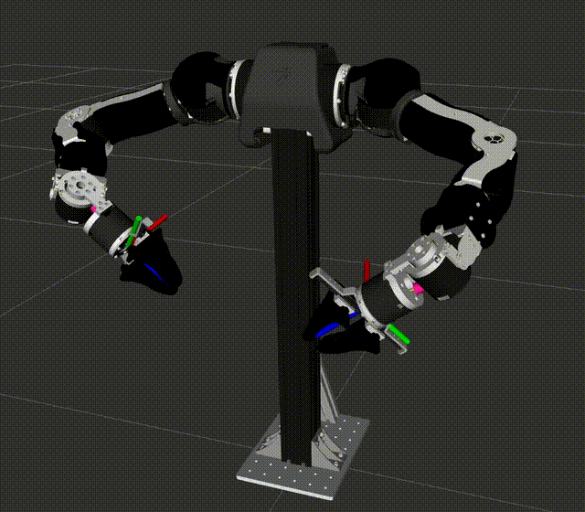

# Motion Control Simulation of OpenArmv10

## Installation

This is a ROS 2 Humble package.
> First download and install the robot_description of *openarm_v10* [here](https://github.com/enactic/openarm_description.git)!!!

```bash
cd ~/ros2_ws/src && git clone https://github.com/wei-hsuan-cheng/openarm_motion_control.git
cd ~/ros2_ws && rosdep update && rosdep install --from-paths src --ignore-src -r -y
colcon build --symlink-install --packages-select openarm_motion_control && . install/setup.bash
```

## Run Demo

- Visualize in RViz2 with joint_state_publisher_gui
    ```bash
    ros2 launch openarm_motion_control visualize_openarm.launch.py \
    arm_type:=v10 \
    bimanual:=true
    # Arguments:
    # ee_type:=none # if no end-effector
    # bimanual:=false # if single arm
    ```

- Bimanual task space motion
    ```bash
    # Robot FK/IK pure visualization
    ros2 launch openarm_motion_control visualize_motion.launch.py
    
    # Simulate robot motion control (first-order dynamics in each joint velocity)
    ros2 launch openarm_motion_control joint_space_motion_control.launch.py
    ros2 launch openarm_motion_control task_space_motion_control.launch.py
    ```

- Robot visualization in RViz2
    <p align="center">
        
    </p>

## Acknowledgements

- **Robot Math Utils**: Some utilities from [Robot Math Utils](https://github.com/wei-hsuan-cheng/robot_math_utils) are used.

## Contact

- **Author**: Wei-Hsuan Cheng [(johnathancheng0125@gmail.com)](mailto:johnathancheng0125@gmail.com)
- **Homepage**: [wei-hsuan-cheng](https://wei-hsuan-cheng.github.io)
- **GitHub**: [wei-hsuan-cheng](https://github.com/wei-hsuan-cheng)